# 🍯 HONEY MOBEE 🍯

## 🔧 개발 Tool

- Django REST Framework

- Vue / JavaScript
- Miro

<br><br><br>

## 🤲 팀원 정보

- 강보성 - Back-end

- 최예린 - Front-end

<br><br><br>

## 🔧 서비스 기능

|  | 기능 | 기능설명 |
| --- | --- | --- |
| 1 | 로그인/ 회원가입 | django token authentication을 이용한 인증 |
| 2 | 로그아웃 | local storage에서 토큰 삭제를 통해 구현 |
| 3 | 유저 정보 조회 | username, 프로필 주소, 리뷰나 글 목록 조회 |
| 4 | 유저 프로필 주소 변경 | local storage에 저장된 프로필 주소 변경 |
| 5 | 유저 신고 | 유저간의 1:N관계로 신고 누적시 is_active= 0 처리되어 로그인 불가 |
| 6 | 단일 영화 조회 | 감독,배우, 트레일러등 정보와 리뷰 정보 조회 |
| 7 | 리뷰 생성 | 별점과 리뷰 작성 |
| 8 | 리뷰 수정 삭제 | 자신이 쓴 리뷰 수정및 삭제 |
| 9 | 리뷰 좋아요 | 각각의 리뷰에 좋아요 기능 구현 |
| 10 | 영화 추천 | 유저들의 영화 리뷰와 선호 영화를 통해 유저간의 유사도를 평가하여 별점이 높을 것으로 예상되는 영화 추천 |
| 11 | 검색 | 배우, 감독, 영화 제목, 영화 줄거리의 일부나 장르를 통해 관련 영화 출력 유저가 검색하거나 메인 페이지에 장르별 영화 출력에 사용 |
| 12 | 배우 검색 | 배우 이름으로 배우 세부 정보 조회 |
| 13 | 감독 검색 | 감독 이름으로 세부 정보 조회 |
| 14 | 선호 영화 입력 | 영화 추천을 위해 처음 로그인시 선호 영화 입력 받음 |

<br><br><br>

## 🗺️ ERD

.jpg)

<br><br><br>

## 🕸️ Vue 컴포넌트 구조

.jpg)

<br><br><br>

## 🔍 **Overview**

### **1. 로그인**

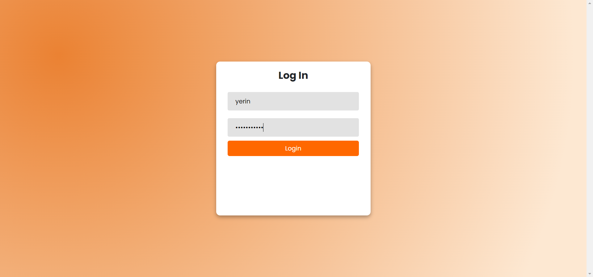

- 설명

    - 사이트를 이용하기 위해서는 우선 회원가입과 로그인이 필요합니다. 로그인이 되지 않은 상태로 접근한다면 404 page로 이동하게 됩니다.

    - 회원가입시 비밀번호를 일치하지 않게 작성하면 다음 페이지로 넘어가지 않습니다.
    - 또한 로그인시 비밀번호가 맞지 않다면 ‘일치하지 않는 회원 정보입니다’라고 alert가 출력됩니다.
- 어려웠던 점

    - 회원가입과 로그인은 이전에도 많이 이용해왔기 때문에 구현에서 어려운 점은 없었습니다. 하지만 UI 면에서 시간이 부족하여 아쉬운 점이 있습니다. 배경 색은 사이트의 메인 색을 기반으로 설정하였습니다.
- 이후 개선할 점

    - 회원가입할 때, 비밀번호가 맞지 않을 때도 alert가 출력되도록 수정할 예정입니다.

<br><br>

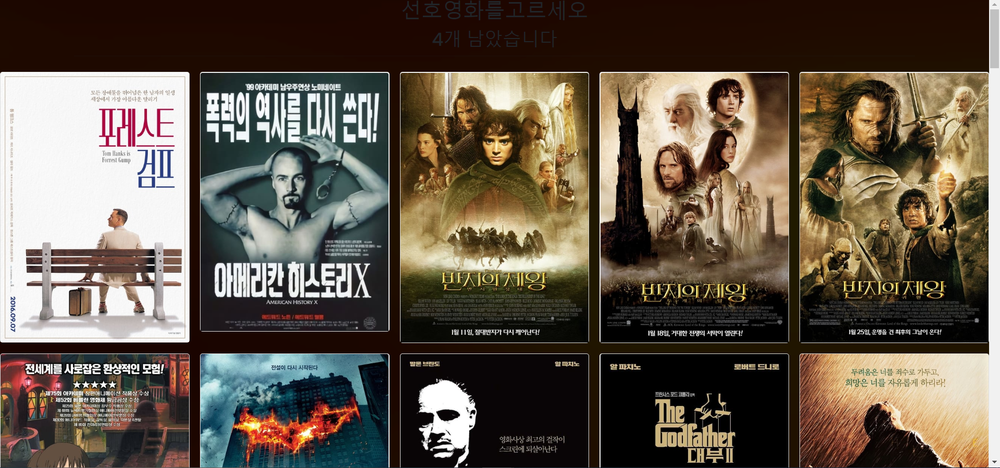

- 설명

    - 회원가입 후 처음으로 로그인을 하면, 선호영화 4개를 고르도록 하였습니다. 4개를 모두 선택하면 선택이 완료되었다고 alert가 출력됩니다.

    - 이를 기반으로 메인페이지 상단에 추천 영화 5개를 보여줍니다.
- 어려웠던 점
    - 어떤 영화를 골랐는지 파악하기 위해 영화를 클릭하면 list에 저장하고 이를 이후에 1칸 띄워서 String으로 만든후 ajax 통신을 통해 Django 서버로 정보 전달하는 것이 어려웠습니다.

- 이후 개선할 점
    - UI에 신경을 쓰지 못한 부분입니다. card component의 height를 맞추고, 전체적인 width를 맞춰야 합니다.

    - 자세히 보면 선호 영화를 고르라는 글자와 유저가 선택한 영화의 개수가 몇 개인지 잘 보이지 않습니다. 직관적으로 알 수 있도록 화면에 fix되도록 수정하면 좋을듯합니다.
    - 영화 순서에 로직 추가하기

<br><br>

### **2. 메인페이지**

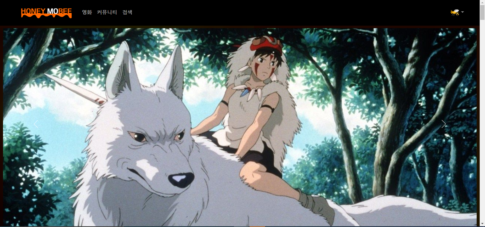

- 설명

    - Navbar의 로고와 ‘영화’ 탭을 통해 main page로 이동할 수 있고, 커뮤니티 page와 검색 page로 이동할 수 있도록 Navbar에 해당 탭을 위치시켰습니다.

    - Navbar 오른쪽 끝에 위치한 프로필 사진을 누르면 마이페이지로 이동할 수 있는 탭과 로그아웃 탭, 회원가입 탭이 Dropdown으로 나타납니다.
    - main page 상단에는 Carousel로 유명한 영화들의 한 장면을 나열해서 사용자가 넘기거나 자동으로 slide될 수 있도록 구성하였습니다.
- 어려웠던 점
    - Navbar를 Vue에서 가장 먼저 구현하였는데, 어려움은 딱히 없었습니다.

    - 기획단계에서는 3D Coverflow effect를 이용하여 영화 포스터를 넘길 수 있도록 기획하였습니다. 이를 위해 awesome-swiper와 owl carousel, Swiper를 이용했지만 계속되는 오류로 구현할 수 없었습니다. 여기에 시간을 너무 많이 쏟아부었고, 마감 기한이 다가왔기 때문에 기본적인 요소만 넣어서 완성하였습니다.
- 이후 개선할 점
    - 기존에 구현하고자 했던 coverflow effect를 구현하는 게 목표입니다.

<br><br>

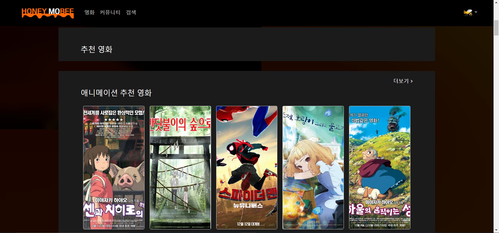

- 설명

    - 처음에 선택했던 선호 영화 4개와 유저가 작성한 한줄리뷰를 바탕으로 추천 영화 5개를 card로 보여줍니다.

    - 추천영화 하단에는 장르별 추천 영화를 5개씩 보여줍니다. 더보기 탭을 클릭하면 검색 페이지로 넘어가, 가지고 있는 데이터 내 해당 장르별 추천 영화를 모두 보여줍니다.
    - 영화 포스터를 click하면 해당 영화의 detail page로 이동합니다.
- 어려웠던 점
    - 메인 페이지는 기능이 많지 않아서 Vue로 구현하는 과정에서 어려움은 없었습니다. 하지만 CSS를 오랜만에 다뤄보고, 시간이 촉박한 상황에서 메인페이지를 만들다보니 UI 구현 과정에서 시행착오가 많았습니다. 우선 영화 포스터의 height와 width를 통일하는 과정에서 뜻대로 되지 않아서 구글링을 통해 해결하였습니다. 또한 장르의 label과 더보기 탭을 배치하는 과정에서 수평이 맞지 않고 원하는 위치에 배치되지 않아서 고생했던 기억이 있습니다.

    - 현재 유저가 선택한 선호 영화와 리뷰 정보를 토대로 다른유저와의 유사도를 계산하여 영화를 추천하는 것에 공을 들였습니다. 코사인 유사도는 크기에 두 영화에 각각 2점, 4점 그리고 5점 10점을 준 두 유저가 유사하다고 판단하므로 리뷰 평점에 평균 점수를 빼서 유사도를 계산했습니다.
- 이후 개선할 점
    - 영화 장르별 label과 더보기 탭이 수평이 맞도록 배치하고 card의 크기를 안정감있게 수정할 필요가 있습니다.

    - 유저가 많이본 장르별로 장르별 추천 영화 정렬하기

<br><br>

### **3. 영화상세페이지**

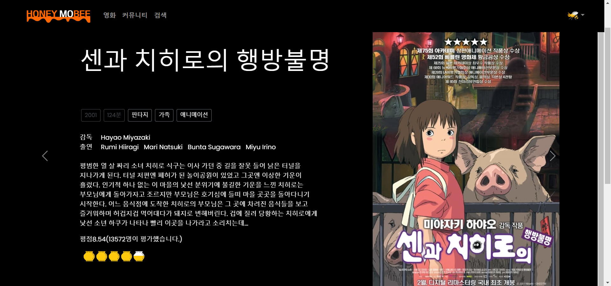

- 설명

    - 영화 detail 페이지는 크게 2가지 component로 구성되어있습니다. 상단에는 **영화정보**, 하단에는 **한줄리뷰 list**로 구성되어있습니다.

    - 우선, 영화정보 중 장르와 감독, 배우 이름에 router-link를 이용하여 클릭하면 검색 페이지로 이동하여 관련 영화 list가 card로 나타나도록 하였습니다.
    - 평점 data를 이용하여 사이트의 컨셉에 맞춰 꿀통으로 평점을 표시하였습니다.
    - 영화정보 component에 carousel을 적용하여 해당 영화의 예고편이 표시되도록 하였습니다.
- 어려웠던 점
    - 영화 정보 component는 여러 레퍼런스를 찾아 본 후, 티빙을 참고하여 UI를 구현하였습니다. 어려웠던 점은 위의 이미지에서 볼 수 있듯이, 영화의 설명 부분과 포스터의 배치가 오른쪽으로 쏠려 있습니다. 이를 해결하려고 다른 분들께 조언을 들었지만 해결하지 못했습니다.

    - 평점 반개를 나타내는것이 생각보다 까다로웠습니다. 처음 꿀통를 클릭했으면 꽉찬 이미지를 같은 꿀통을 한번더 클릭했다면 반개가 이미지가 나오도록 했습니다.
- 이후 개선할 점

    - 영화 설명 파트와 포스터의 배치를 수정해야 합니다. Bootstrap에서 justify-content-between을 이용하였는데도 위와 같이 배치되어서 원인을 찾아야합니다.

    - DB에 영화가 받은 전체 평점합을 저장해야합니다. 평가를 받을때 마다 평균 평점과 사람수를 곱하는 등의 연산을 줄일 수 있기 때문입니다.

<br><br>

### **4. 한줄리뷰**

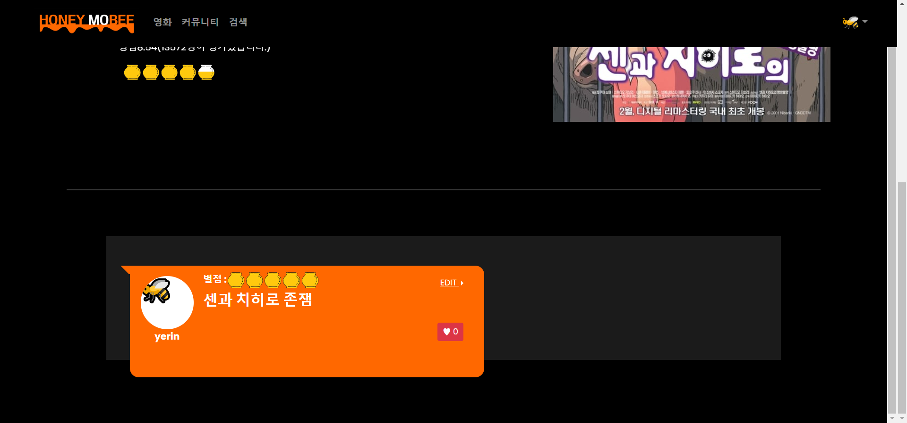

- 설명

    - 리뷰 등록 버튼의 position을 fixed하여 영화 정보를 읽으면서 바로 리뷰를 등록할 수 있도록 하였습니다.

    - 리뷰 등록 버튼을 클릭하면 modal로 영화의 별점과 한줄리뷰를 작성할 수 있도록 하였습니다. 별점은 꿀통을 한 번 누르면 2점(꽉 차게), 한 번 더 누르면 1점(반 정도 차게)으로 설졍하였습니다.
    - 계정당 한 영화에 하나의 리뷰만 작성할 수 있도록 하였습니다.
    - 리뷰를 등록하면 위와 같이 프로필 사진과 함께 별점, 리뷰, 수정탭, 좋아요 버튼이 말풍선 안에 나타납니다.
    - 프로필 사진을 누르면 해당 리뷰 작성자의 page로 이동하게 되고, 해당 리뷰가 마음에 들면 좋아요를 누를 수 있습니다.
    - 리뷰의 작성자라면 EDIT 탭을 통해 리뷰의 수정과 삭제를 할 수 있습니다. EDIT 탭은 Dropdown으로 나타냈습니다.
    - 미리 비속어 데이터를 만들어 두어서, 리뷰 내용 중 비속어가 있다면 ‘바르고 고운말!’이라는 alert가 표시됩니다.
- 어려웠던 점
    - 좋아요를 눌렀을 때 page가 새로고침되지 않으면서 바로 적용되도록 하고 싶었습니다. 해당 리뷰의 좋아요 수를 vue에 저장하여 비동기 처리 했습니다.
    
    - 해당 리뷰를 수정할 때 기존 데이터를 불러오는 방법이 어려웠습니다. Vue에서 기존 리뷰를 가져오는 함수와 crated를 이용하여 기존 데이터를 가져올 수 있었습니다.
- 이후 개선할 점
    - 말풍선의 크기와 한줄리뷰 배경의 크기가 맞지 않습니다. 또한 프로필 사진이 왼쪽으로 치우쳐 있어서 정방향으로 위치하도록 수정해야 합니다.

    - 자신이 쓴 리뷰는 오른쪽에서 나오고 말풍선 색이 다른 것 같은 UI 개선이 필요합니다.

<br><br>

### **5. 커뮤니티**

- 5.1. 커뮤니티
    
    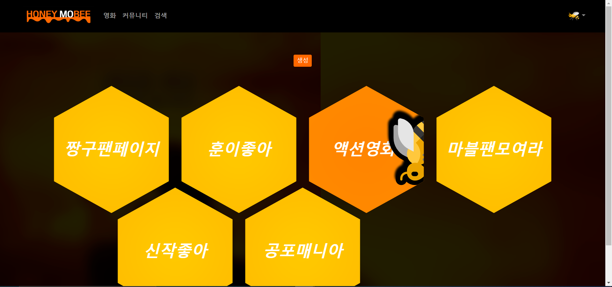
    
    - 설명

        - 커뮤니티 페이지는 팬카페처럼 관심사가 비슷한 유저들끼리 커뮤니티를 형성할 수 있는 페이지입니다.

        - 상단의 생성 button을 누르면 modal로 커뮤니티명과 썸네일 주소를 입력할 수 있도록 구성하였습니다.
        - 커뮤니티 생성을 완료하면 컨셉과 맞춰 벌집 모양으로 커뮤니티 목록이 나오고, hover effect를 이용하여 마우스 커서를 올릴 때 벌이 나타나도록 하였습니다.
    - 어려웠던 점

        - Vue로 구현하는데 있어서는 어려운 점이 없었습니다.

    - 이후 개선할 점

        - front는 없습니다.

<br><br>

- 5.2. 커뮤니티 detail 페이지
    
    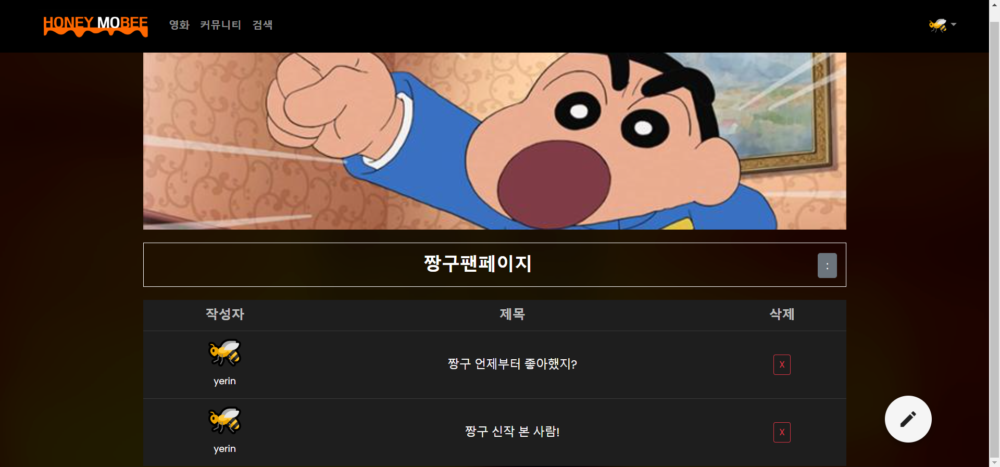
    
    - 설명

        - 커뮤니티 detail 페이지는 해당 커뮤니티의 썸네일과 커뮤니티명, 커뮤니티 내 게시물 list를 보여줍니다. 또한 커뮤니티의 생성자라면 커뮤니티명 오른쪽에 위치한 버튼을 클릭하여 해당 커뮤니티를 수정, 삭제할 수 있습니다.

        - 해당 페이지의 오른쪽 하단에 button을 통해 게시물을 생성할 수 있습니다.
        - 게시물을 생성하면 위의 사진과 같이 커뮤니티명 아래에 작성자와 제목, 삭제 버튼이 목록으로 보여집니다. 작성자를 클릭하면 작성자 page로 이동하고, 제목을 클릭하면 게시물 detail page로 이동합니다.
    - 어려웠던 점
        - 해당 페이지에서는 CSS가 가장 어려웠습니다.  각 요소의 배치를 기획단계에서 detail하게 잡지 않아서 생각보다 시간을 더 쓰게 되었습니다.

    - 이후 개선할 점
        - 게시물 생성 페이지 UI 구현 필요합니다.

<br><br>

- 5.3. 게시물 detail 페이지
    
    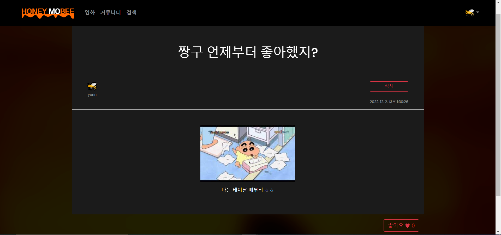
    
    - 설명

        - 게시물의 detail 페이지로, 크게 두 개의 component로 구성되어 있습니다. 상단에는 게시물의 세부 정보, 하단에는 댓글 목록이 표시됩니다.

        - 게시물의 세부 정보에는 제목과 작성자, 작성시간, 내용, 이미지, 좋아요가 포함되어 있습니다.
        - 작성자를 클릭하면 작성자의 page로 이동합니다.
        - 게시물의 작성자라면 삭제 button이, 작성자가 아니라면 신고 button이 표시되도록 하였습니다.
        - 자신의 글이 아니면 신고할수 있습니다.
    - 어려웠던 점
        - CSS가 가장 어려웠습니다. 마감 3~4시간 전에 CSS를 마쳐서 UI면에서 아쉬운 점이 많습니다. 특히 좋아요 button의 위치가 애매하게 배치되어 있습니다.
    - 이후 개선할 점
        - 좋아요 button을 게시물 하단으로 옮겨야 합니다.

<br><br>

- 5.4. 댓글
    
    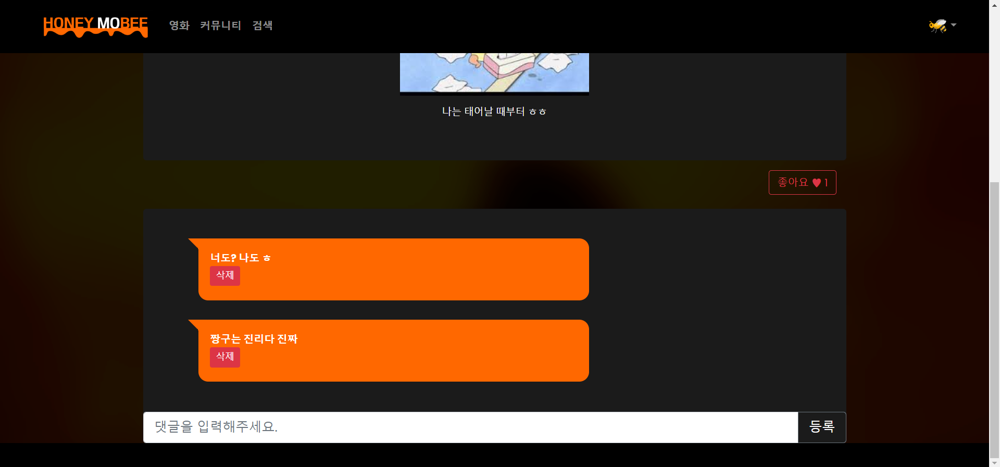
    
    - 설명

        - 댓글의 목록을 말풍선으로 보여주고, 댓글을 입력할 수 있습니다.

        - 댓글의 작성자라면 삭제 버튼이, 작성자가 아니라면 신고 버튼이 표시되도록 하였습니다.
    - 어려웠던 점
        - 해당 게시물에 해당하는 댓글을 보여줘야 했기 때문에 고민을 많이 했습니다. Vue에서 filter를 이용하여 댓글의 article 정보와 article의 id가 일치하면 보여주도록 코드를 작성하였습니다.

    - 이후 개선할 점

        - 말풍선의 색의 채도를 낮출 필요가 있고, 삭제 버튼을 말풍선의 오른쪽으로 이동시켜야 합니다.

<br><br>    

### **6. 검색**

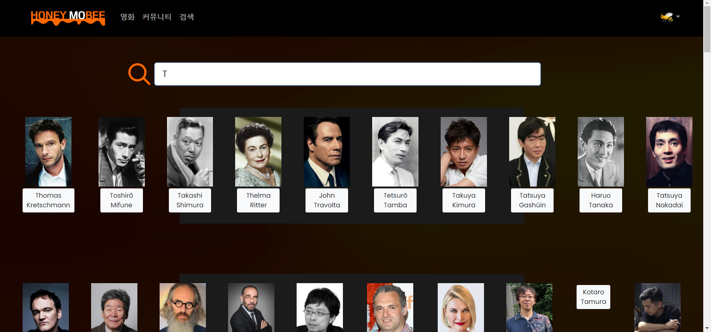

- 설명

    - 검색 페이지 상단에 검색창을 배치하여 장르과 감독, 배우를 검색할 수 있도록 하였습니다. 또한 비동기로 구현하여 입력을 할 때마다 검색 결과가 바뀝니다.

    - 검색 결과는 3개로 나눠서 출력되는데, 배우와 감독, 영화 포스터가 card로 출력됩니다.
    - 해당 감독이나 배우를 클릭하면 검색창에 클릭한 사람의 이름이 입력되고 해당하는 영화 포스터를 card로 보여줍니다.
    - 영화 포스터를 클릭하면 해당 영화의 detail 페이지로 이동합니다.
- 어려웠던 점
    - 영화 상세 페이지에서 넘어온경우 검색창에 문자열이 입력되지만 결과는 나오지 않았습니다. `created` 를 이용해서 해결했습니다.

- 이후 개선할 점
    - UI에 신경을 못 쓴 page입니다. 따라서 전체적인 width와 배치를 수정해야 합니다.

    - 해당 검색어에 관련된 결과가 없으면 에러가 발생합니다.

<br><br>

### **7. 마이페이지**

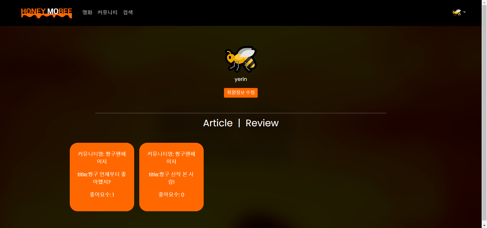

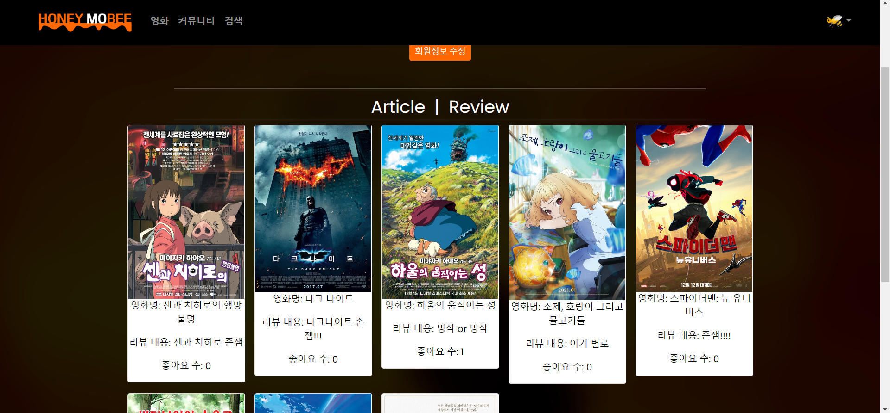

- 설명

    - 프로필 사진과 해당 유저가 작성한 게시물, 한줄리뷰가 보여지게 됩니다.

    - 로그인한 유저 본인의 페이지라면 회원정보 수정 button이 보이고, 타인의 페이지라면 신고 button이 보이게 됩니다.
    - 회원정보 수정을 누르면 modal로 프로필 이미지를 수정할 수 있는 창이 나타나고, 저장하기 전에 미리보기로 프로필을 확인할 수 있습니다.
    - 유저가 작성한 게시물과 한줄리뷰를 card로 보이도록 하였습니다. 해당 card를 누르면 해당 게시물의 detail 페이지나 해당 영화의 detail 페이지로 이동하게 됩니다.
- 어려웠던 점
    - 프로필 사진 변경에서 많은 문제가 있었습니다. 프로필 변경을 하면 Django 서버에 이미지 주소를 저장하고 Vue에선 AJAX통신을 통해 변경된 정보를 받아서 Store에 저장했습니다.

- 이후 개선할 점
    - 마감 1~2시간 전에 CSS를 완료한 페이지입니다. 따라서 부족한 부분이 많습니다. 우선 card의 height가 고정되도록 수정해야 하고, 전체적인 UI 또한 수정해야 합니다.
    
    - 이미지 url을 통해 프로필 변경을 하고 있습니다. 유저로 부터 파일을 받아 변경하기
    - 프로필 변경시 현재 화면에서 narv바의 프로필사진도 바뀌기

<br><br>

### **8. 404page**

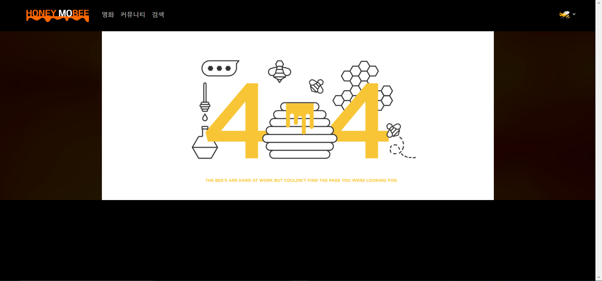

- 설명

    - 없는 url 링크로 이동시 404 페이지가 뜨도록 하였습니다.
- 이후 개선할 점
    - 해당 이미지를 누르면 이전 페이지로 이동하도록 구현하면 좋을듯합니다.

<br><br><br>

## 🏃 Steps to run

```html
Backend
$ cd final-pjt-back/
$ python -m venv venv
$ source venv/Scripts/activate
$ pip install -r requirements.txt
$ python manage.py migrate
$ python manage.py loaddata actors.json director.json genre.json movies.json
$ python manage.py runserver
```

```html
Frontend
$ cd final-pjt-front/
$ npm i
$ npm run serve
```

<br><br>

## 😆 느낀점

- 강보성

    - vue에서 정말 많은 종류의 error를 본 것 같습니다.  `lifecycle`이나 computed의 논리에 대해 다시 생각해보는 시간을 가졌습니다.

    - 프로젝트 계획, 기획의 중요성을 깨달았던 것 같습니다. 기획을 먼저 끝내지 않았더라면 더 헤맸을 것입니다.
    - 사실 Django와 DB 공부를 안해서 시험 성적이 낮았는데 프로젝트를 통해 성장한 것 같습니다.
    - 욕심을 조금은 버려야 프로젝트가 잘 굴러 가는것 같다.
    
<br>

- 최예린
    - 프로젝트를 하면서 많은 시행착오를 마주쳤고, 성장도 많이 하였습니다. 이번 프로젝트에서 front를 맡았고 Vue를 이용하여 구현하였습니다. 다행히 이전에 배운 내용을 그대로 사용하면 되는 게 많아서 수월한 부분도 있었습니다. 하지만 댓글 기능이나 좋아요 기능처럼 이전에 Vue로 구현해보지 않았던 기능은 머리를 싸매고 고민을 해야 했습니다. 다행히 다른 팀도 해당 기능을 이용했기에 막히는 부분은 구글링을 하거나 주변 사람들에게 조언을 얻으며 해결할 수 있었습니다.

    - 가장 큰 문제는 CSS입니다. 시간 배분을 잘못하여 CSS를 할 시간이 압도적으로 부족하였습니다. back을 맡은 보성님이 많이 도와주셔서 이정도로 구현할 수 있었습니다. 이번에 carousel를 구현하며 시간을 많이 허비하였습니다. 너무 한 기능에 목 매지 않고 시간 배분을 적절히 해야한다는 것을 배울 수 있었습니다.
    - 기능은 정말 잘 갖춰졌지만 이를 보여주는 CSS가 너무 빈약하다는 것이 아쉽습니다. 또한 CSS를 더 효율적으로 작성할 수 있는 방법에 대해 공부하고자 합니다.
    - 손이 느려서 속도가 느린데도 화 안 내고 같이 으싸으쌰해준 보성님께 고마움을 느낍니다. 저에게 이번 프로젝트가 좋은 경험으로 남았듯이 보성님한테도 좋은 경험으로 남았으면 좋겠습니다.

<br><br>

---